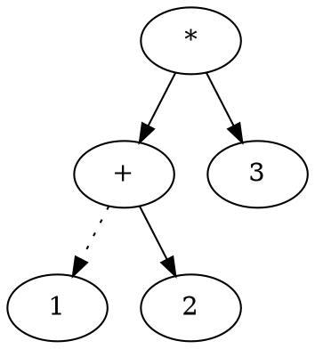

# 树

## 概念

1. 树叶（叶子节点）  
2. 兄弟节点，祖父节点，孙子节点  
3. 路径，节点深度 —— 从根到该节点的路径长度（根节点的深度为0），高度 —— 从该节点到到所有叶子节点最长的路径  
4. 祖先，后裔，真祖先，真后裔

使用python表示的树或二叉树的数据结构：

```python
class Tree(object):
    def __int__(value):
        self.value = value
        self.left = null
        self.right = null
        self.childs = []
```

## 二叉树（binary tree）

二叉树的应用主要有：**表达式树**，语法树，**查找**（二叉查找树），**数据库（B-tree）**

### 二叉树应用

1. 表达式树
操作数，操作符



中缀表达式：( 1 + 2 ) * 3 —— 表示最直观，而且要借用括号才能正确表达
后缀表达式：1 2 + 3 * —— 计算机计算结果最方便，无需借用括号
前缀表达式：* + 1 2 3

#### 实践一

1. 中缀表达式转后缀表达式（请画流程图）

2. 后缀表达式计算结果

3. 从后缀表达式构建表达式树

### 二叉查找树（binary serach tree）

二叉查找树是特殊的二叉树，特殊性在哪里？  

1. 二叉查找树的平均深度为O(logN)，而二叉树的平均深度为O(N^1/2)  
2. 二叉树不是和搜索相关的，比如二叉表达式树，但是二叉查找树是和搜索强相关的

### 平衡二叉查找树

平衡二叉查找树：主要为了解决二叉查找树在动态增删节点的过程中导致节点平均深度过大的问题。

### AVL树

AVL树得名于它的发明者G. M. Adelson-Velsky和Evgenii Landis  
AVL树定义：

**旋转：**
因为插入某个节点而导致A节点不平衡，此时需要旋转二叉树（一次或两次旋转）使得它重新平衡，只有下面四种情况的插入导致A失去平衡（注意是以A为基准的）：  

1. 对A的左儿子的左子树进行了一次插入

    ```dot
    digraph G {
        subgraph clusterOrigin {
            nroot_o [label="5"]
            nleft_o [label="3"]
            nright_o [label="null0"]
            nroot_o -> nleft_o
            nroot_o -> nright_o
            label="原树"
        }

        subgraph clusterInsert {
            nroot_i [label="5"]
            nleft_i [label="3"]
            nleft_i_of_3 [label="1"]
            nright_i [label="null0"]
            nroot_i -> nleft_i
            nroot_i -> nright_i
            nleft_i -> nleft_i_of_3 [style="dotted"]
            nleft_i -> null1
            label = "插入数字1"
        }
    }
    ```

    ```dot
    digraph G {
        3 -> 1
        3 -> 5
        5 -> null1
        5 -> null0
    }
    ```

2. 对A的左儿子的右子树进行了一次插入

    ```dot
    digraph G {
        subgraph clusterOrigin {
            nodek1 [label="k1"]
            nodek3 [label="k3"]
            nodeA [label="A" shape="triangle"]
            nodek2 [label="k2"]
            nodeB [label="B" shape="triangle"]
            nodeC [label="C" shape="triangle"]
            nodeD [label="D" shape="triangle"]
            nodek3 -> nodek1
            nodek3 -> nodeD
            nodek1 -> nodeA
            nodek1 -> nodek2
            nodek2 -> nodeB
            nodek2 -> nodeC
        }

        subgraph clusterAfter {
            node_k1 [label="k1"]
            node_k3 [label="k3"]
            node_A [label="A" shape="triangle"]
            node_k2 [label="k2"]
            node_B [label="B" shape="triangle"]
            node_C [label="C" shape="triangle"]
            node_D [label="D" shape="triangle"]
            node_k2 -> node_k1
            node_k2 -> node_k3
            node_k1 -> node_A
            node_k1 -> node_B
            node_k3 -> node_C
            node_k3 -> node_D

        }
    }
    ```

3. 对A的右儿子的左子树进行了一次插入
4. 对A的右儿子的右子树进行了一次插入

## B-tree

首先B-tree是一种查找树，M阶B-tree，所有的数据都存在树叶节点上。

* 所有的树叶都在相同的深度
* 除了根外，所有非树叶节点的儿子数在celi(M/2)和M之间
* 树的根或者是一片树叶，或者其儿子数在2和M之间

## 树的遍历

先序遍历，后序遍历，中序遍历都是相对根节点而言的，使用递归即可遍历完成，而且时间复杂度为O(N)。

1. 中序遍历 —— 先左子树，然后根节点，最后右子树

2. 先序遍历 —— 先根节点，然后左子树，最后右子树

3. 后序遍历 —— 先左子树，然后右子树，最后根节点

层序遍历 —— 使用队列结构完成遍历

#### 实践二

1. 写一个代码，以树形式打印一个目录  
2. hello
